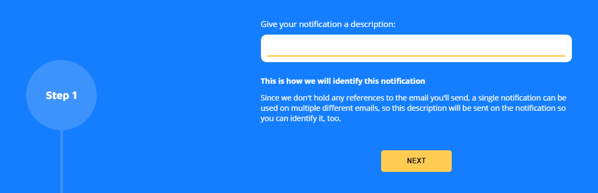
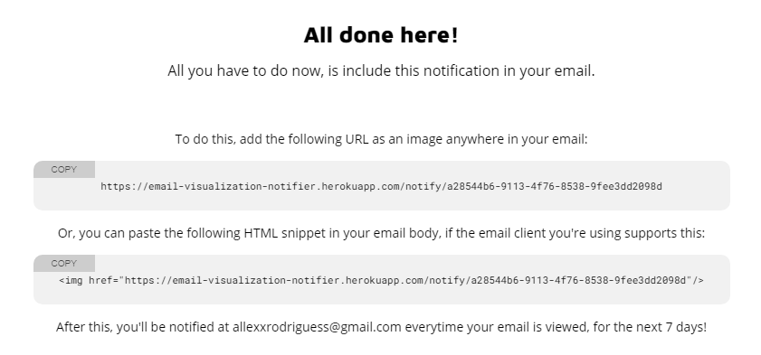
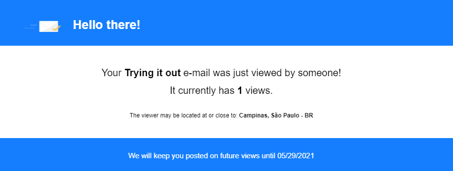

  

__Get notified whenever your emails are viewed!__

#

## How to use it

First, follow the steps [at the website](https://email-read-confirmation.vercel.app/) to define your notification.

  

Then, an URL will be generated, which you'll use on your emails (or anywhere you can put an image, actually).

  

After this, just add an image to your email body using that URL. As soon as someone opens it, you'll receive a notification email at the address you provided previously.

  

## How it works

The idea behind how the notification works is quite simple: the URL generated will actually point to a special endpoint, which will respond with a fully transparent 1x1 PNG image, while also triggering the notification identified by the UUID seen at the end of the URL.

This means that it can be used anywhere where you can add an image using an URL. You can, for instance, create a notification, open the link in your web browser, and still get the notification email.

## Development

To set up the project locally:

- Install [Docker](https://www.docker.com/) if you don't have it already (we'll need it for a redis container)
- Clone the repo
- Run the `yarn` to install dependencies
- Start the node API by running `yarn dev:backend`
- Once the server is up, start the frontend app with `yarn dev:frontend`
